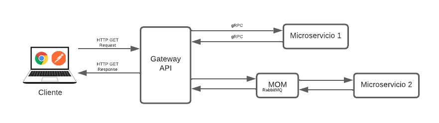
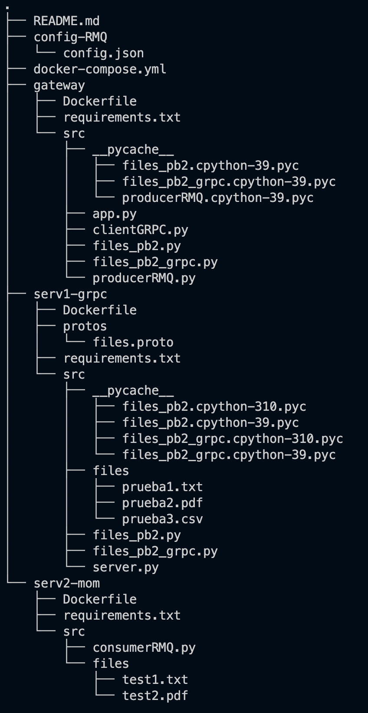

# ST02363 Tópicos Especiales en Telemática

# Estudiante: Alejandro Torres Muñoz, eatorresm@eafit.edu.co

# Profesor: Edwin Nelson Montoya Munera, emontoya@eafit.edu.co

# Reto 2

# 1. breve descripción de la actividad
Para este reto, se implementaron 3 microservicios:

- **Microservicio 1:** Encargado de listar archivos a través de gRPC. Se comunica con el API Gateway.

- **Microservicio 2:** Encargado de buscar archivos mediante una query a través de MOM (RabbitMQ). Se comunica con el API Gateway.

- **Microservicio API Gateway:** Encargado de funcionar tanto como gateway como balanceador de cargas y proxy.
  

## 1.1. Qué aspectos cumplió o desarrolló de la actividad propuesta por el profesor (requerimientos funcionales y no funcionales)

- Implementación de microservicio 1.
- Implementación de microservicio 2.
- Implementación de microservicio API Gateway.
- Comunicación vía gRPC para el microservicio 1.
- Comunicación vía MOM (RabbitMQ) para el microservicio 2.
- Comunicación API Rest entre cliente y API Gateway.
- Archivos de configuración dinámicos.
- Implementación de endpoints tanto para listar archivos como para buscar.
- Concurrencia para cada microservicio.

## 1.2. Que aspectos NO cumplió o desarrolló de la actividad propuesta por el profesor (requerimientos funcionales y no funcionales)

Todos los requerimientos fueron implementados.

# 2. información general de diseño de alto nivel, arquitectura, patrones, mejores prácticas utilizadas.

Podemos observar 4 componentes fundamentales para el desarrollo y la arquitectura del proyecto:

1. API Gateway.
2. Microservicio 1.
3. MOM (RabbitMQ).
4. Microservicio 2.

El cliente hace una petición sea a través de su navegador web, o desde Postman. Éste se comunica mediante API Rest. El API Gateway a su vez se comunica mediante gRPC con el primer microservicio, el cual es el encargado de listar archivos. El segundo microservicio es mediante comunicación MOM, utilizando RabbitMQ. Este funciona con colas y es el encargado de buscar archivos a través de una query que el usuario pasa. Dependiendo del tipo de solicitud que se haga se toma una comunicación u otra.

- Se utilizó Python como lenguaje de programación.
- Se utilizó Docker como orquestador del sistema.
- Como buenas prácticas se hace uso de variables de entorno, métodos desacoplados y directorios bien distribuidos.

# 3. Descripción del ambiente de desarrollo y técnico: lenguaje de programación, librerias, paquetes, etc, con sus numeros de versiones.

Todos los servicios fueron implementados con Python 3.10.6. En el proyecto, encontrará un archivo llamado "requirements.txt", donde se especifican la lista de bibliotecas utilizadas.

    Flask==2.2.3
    grpc==1.0.0
    grpcio==1.51.3
    pika==1.3.1
    protobuf==4.22.0
    python-dotenv==1.0.0

Flask se utilizó para implementar la puerta de enlace API, grpcio es la biblioteca del kit de herramientas gRPC para implementar el microservicio 1 y pika es la biblioteca de cliente RabbitMQ para implementar el microservicio 2.

## como se compila y ejecuta.

1. El proyecto está dockerizado, por lo que deberás correr en primera instancia:

    sudo apt update
    sudo apt install docker.io -y
    sudo apt install docker-compose -y
    sudo apt install git -y

    sudo systemctl enable docker
    sudo systemctl start docker
    sudo usermod -a -G docker ubuntu

2. Cuando hayas corrido los comandos, deberas clonar el repositorio:

    git clone https://github.com/Alejandro2144/eatorresm-st0263.git

3. Cuando hayas clonado el repositorio, deberas situarte en la carpeta eatorresm-st0263, y ejecutar:

    sudo docker-compose build

4. Cuando se haya construido el contenedor, deberas levantarlo con:

    sudo docker-compose up

5. Finalmente, deberás de esperar a que todo se ejecute y podrás utilizar el proyecto.
## detalles del desarrollo.

Se implementó como primera instancia, el microservicio 1, este permite consultar los archivos mediante una comunicación gRPC. Luego de tener funcionando este microservicio, se procede a utilizar Flask como API Gateway. Finalmente se implementa el microservicio 2, el cual permite buscar los archivos mediante una query, y se comunica mediante MOM, precisamente con RabbitMQ.

- Proyecto desarrollado en Python.
- Se orquestó mediante Docker.
- Se utilizó Git como versión de controles.
- Se desplegó en una máquina virtual de AWS.

## detalles técnicos

- **Arquitectura:** Microservicios.
- **Comunicacion entre microservicios:** gRPC y RabbitMQ.
- **Plataforma y servicios en nube:** Amazon AWS (EC2 Ubuntu, IPs elásticas)
- **Orquestación del proyecto:** Docker

## descripción y como se configura los parámetros del proyecto (ej: ip, puertos, conexión a bases de datos, variables de ambiente, parámetros, etc)

Cada microservicio cuenta con su .env, donde:

- Gateway: 

    ROOT_PATH=/app/src/files
    HOST_GRPC=serv1-grpc
    HOST_RMQ=rabbitmq
    PORT_GRPC=50051
    PORT_RMQ=5672
    USER=guest
    PASSWORD=guest

- Microservicio 1: 

    ROOT_PATH=/app/src/files
    SERVER_ADDRESS=serv1-grpc
    PORT=50051

- Microservicio 2:

    HOST=rabbitmq
    PORT=5672
    USER=guest
    PASSWORD=guest
    QUEUE=archivo_rpc
## opcional - detalles de la organización del código por carpetas o descripción de algún archivo. (ESTRUCTURA DE DIRECTORIOS Y ARCHIVOS IMPORTANTE DEL PROYECTO, comando 'tree' de linux)

# 4. Descripción del ambiente de EJECUCIÓN (en producción) lenguaje de programación, librerias, paquetes, etc, con sus numeros de versiones.

 Aplica el mismo lenguaje, librerías, paquetes y demás, utilizados en ambiente de desarrollo.

# IP o nombres de dominio en nube o en la máquina servidor.

La máquina virtual está corriendo en la siguiente ip elástica: 18.214.102.136:5000

## descripción y como se configura los parámetros del proyecto (ej: ip, puertos, conexión a bases de datos, variables de ambiente, parámetros, etc)

Puesto que el proyecto se construyó utilizando docker-compose, el ambiente de ejecucion tanto en desarrollo como en producción es el mismo. Lo que se debe tener presente es que deben habilitar los puertos necesarios en AWS para permitir las comunicaciones.

## como se lanza el servidor.

1. En su navegador ingrese a AWS.
2. Acceda a EC2 y busque la instancia st0263-eatorresm
3. Inicie la instancia y conectese a ella.
4. Dirijase al directorio correspondiente: /eatorresm-st0263
5. Corra sudo docker-compose up
6. Espere a que se inicialicen. 

## una mini guia de como un usuario utilizaría el software o la aplicación

Para conectarse al API Gateway se debe hacer una peticion HTTP a la IP elastica de AWS y al puerto 5000.

Para conectarse, deberá hacer una petición HTPP a la siguiente ip elástica 

    http://18.214.102.136:5000

Ambas peticiones funcionan como un GET, por lo que podremos acceder a los endpoints: /files y /search-files

    http://18.214.102.136:5000/files -> lista todos los archivos que se encuentran en el directorio.

    http://18.214.102.136:5000/search-files?query=nombre_archivo -> busca el archivo con el nombre nombre_archivo en el directorio.

Con Postman funciona similar, solicitamos una petición GET, y en parámetros debemos poner la query y el nombre del archivo a buscar en value (en caso de utilizar search-files). Las respuestas son en formatos .json.

## opcionalmente - si quiere mostrar resultados o pantallazos

# referencias:

  - https://grpc.io/docs/what-is-grpc/introduction/
  - https://grpc.io/docs/languages/python/basics/
  - https://www.rabbitmq.com/tutorials/tutorial-six-python.html
  - https://flask.palletsprojects.com/en/2.2.x/quickstart/

#### versión README.md -> 1.0 (2022-agosto)
