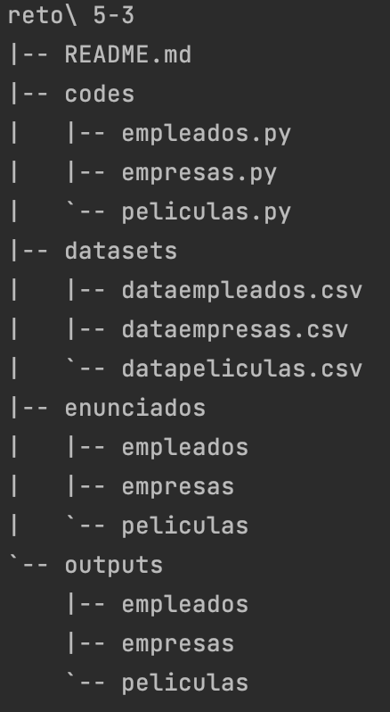

# Info de la materia: ST0263 Topicos Especiales en Telematica

# Estudiante: Alejandro Torres Muñoz, eatorresm@eafit.edu.co

# Profesor: Edwin Nelson Montoya, emontoya@eafit.brightspace.com

# Reto 5, 5.3.1 - Map Reduce

# Descripcion de la actividad

Ejercicios básicos de MapReduce con MRJOB en python

## Que aspectos cumplió o desarrolló de la actividad propuesta por el profesor (requerimientos funcionales y no funcionales)

- Para el datasets de "dataempleados.csv" se desarrolló:

  1. El salario promedio por Sector Económico (SE)
  2. El salario promedio por Empleado
  3. Número de SE por Empleado que ha tenido a lo largo de la estadística

- Para el datasets de "datempresas.csv" se desarrolló:

  1. Por acción, dia-menor-valor, día-mayor-valor
  2. Listado de acciones que siempre han subido o se mantienen estables.
  3. DIA NEGRO: Saque el día en el que la mayor cantidad de acciones tienen el menor valor de acción (DESPLOME), suponga una inflación independiente del tiempo.

- Para el datasets de "datapeliculas.csv" se desarrolló:

  1. Número de películas vista por un usuario, valor promedio de calificación
  2. Día en que más películas se han visto
  3. Día en que menos películas se han visto
  4. Número de usuarios que ven una misma película y el rating promedio
  5. Día en que peor evaluación en promedio han dado los usuarios
  6. Día en que mejor evaluación han dado los usuarios
  7. La mejor y peor película evaluada por genero

## Que aspectos NO cumplió o desarrolló de la actividad propuesta por el profesor (requerimientos funcionales y no funcionales)

Todos los requerimientos fueron empleados.

# Descripcion del ambiente de ejecucion

- Local: MacOs Ventura 13.2
- Python3.10
- MRJob

# Ejecucion de la actividad

- Instalar MRJob.

`pip install mrjob`

- Descargar los datasets necesarios para los ejercicios. Estos son `datapeliculas`, `dataempresas` y `dataempleados`. Podrá encontrarlos en S3 en AWS.

# Se anexa árbol de carpetas
