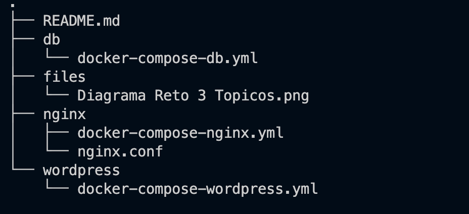
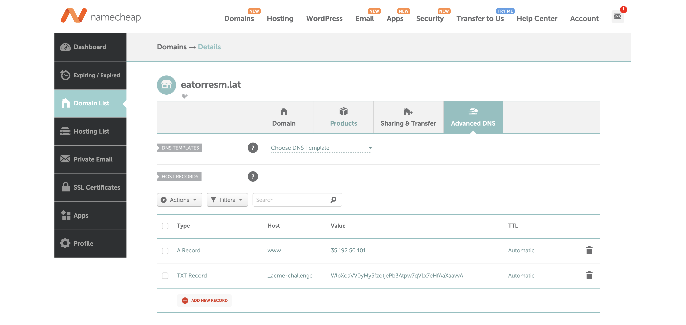
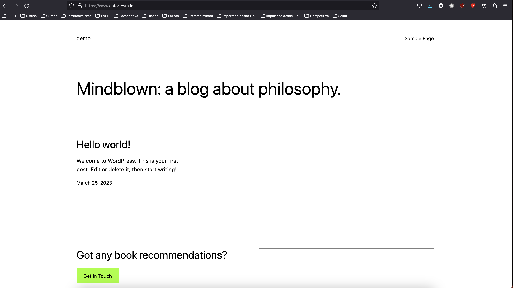

# ST02363 Tópicos Especiales en Telemática

# Estudiante: Alejandro Torres Muñoz, eatorresm@eafit.edu.co

# Profesor: Edwin Nelson Montoya Munera, emontoya@eafit.edu.co

# Reto 2

# 1. breve descripción de la actividad

Desplegar un CMS wordpress empleando contenedores, con dominio propio dominio y certificado SSL.

Se utilizará Nginx como balanceador de cargas, dos servidores adicionales tanto para la base de datos (DBServer) como para archivos (FileServer).

## 1.1. Qué aspectos cumplió o desarrolló de la actividad propuesta por el profesor (requerimientos funcionales y no funcionales)

1. Aplicación wordpress dockerizada monolítica en varios nodos que mejore la disponibilidad de la aplicación.
2. Implementar un balanceador de cargas basado en nginx que reciba el tráfico web https de Internet con múltiples instancias de procesamiento.
3. Tener 2 instancias de procesamiento wordpress detrás del balanceador de cargas.
4. Tener 1 instancia de bases de datos mysql.
5. Tener 1 instancia de archivos distribuidos en NFS.
6. Certificado SSL.

## 1.2. Que aspectos NO cumplió o desarrolló de la actividad propuesta por el profesor (requerimientos funcionales y no funcionales)

Todos los requerimientos fueron implementados.

# 2. información general de diseño de alto nivel, arquitectura, patrones, mejores prácticas utilizadas.

Podemos observar 5 instancias fundamentales para el desarrollo y la arquitectura del proyecto:

1. Nginx - Balanceador de carga y proxy.
2. Wordpress 1.
3. Wordpress 2.
4. Base de datos MySQL.
5. NFS Server

Arquitecuta: El reto incorpora un disñeo monolítico, donde hay varios nodos que aseguran la alta disponibilidad de la misma.

Mejores prácticas: Implementación de contenedores (con una configuración óptima para el ahorro de recursos), certificado SSL, separación de recursos mediante directiorios y/o carpetas.

# 3. Descripción del ambiente de desarrollo y técnico: lenguaje de programación, librerias, paquetes, etc, con sus numeros de versiones.

Nginx: 10.128.0.13
Wordpress 1: 10.128.0.8
Wordpress 2: 10.128.0.9
DB MySQL: 10.128.0.12
NFS: 10.128.0.11

## como se compila y ejecuta.

1. El proyecto está dockerizado, por lo que deberás correr en primera instancia:

Para cada maquina se tiene que verificar de que los contenedores esten up y para eso se tiene que subir los docker-compose para cada una de la maquina.

Para la maquina de la base de datos:

Entrar a la maquina por SSH -> eatorresm-st0263 -> Reto3 -> db

Después utilizar el siguiente comando:

docker-compose -f docker-compose-db.yml up -d

Para la maquina de Wordpress 1:

Entrar a la maquina por SSH -> eatorresm-st0263 -> Reto3 -> wordpress

Después utilizar el siguiente comando:

docker-compose -f docker-compose-wordpress.yml up -d

Para la maquina de Wordpress 2:

Entrar a la maquina por SSH -> eatorresm-st0263 -> Reto3 -> wordpress

Después utilizar el siguiente comando:

docker-compose -f docker-compose-wordpress.yml up -d

Para la maquina de NGINX:

Entrar a la maquina por SSH -> eatorresm-st0263 -> Reto3 -> nginx

Después utilizar el siguiente comando:

docker-compose -f docker-compose-nginx up -d

Despues, podrás ingresar al dominio: https://www.eatorresm.lat

## Detalles del desarrollo.

Los detalles mas importantes en el desarrollo fueron:

1. En la maquina virtual de NGINX se tuvo que hacer un proceso mas largo, debido a que se debia de sacar la certificación para poder que el dominio corriera por https. Luego se tuvo que modificar el nginx.config para que actuara como LOAD BALANCER y que redireccionara la carga a los wordpress.

2. En la maquina del NFS, se tuvo que colocar la siguiente linea en /etc/exports

    /var/nfs/general    10.128.0.0/16(rw,sync,no_root_squash,no_subtree_check)

Para poder tener la comunicacion con ambos wordpres y poder guardar los archivos en su respectiva carpeta.

3. Para los Wordpress, se tuvo que agregar la dirección IP de la base de datos para cada docker-compose y ademas de eso se tuvo que realizar el comando

    sudo mount 10.128.0.12:/var/nfs/general /mnt/wordpress

Para poder montar los datos en el nfs y que ambos wordpress recogieran la misma información.

## Detalles técnicos

Plataforma y servicios en nube: Google Cloud Platform (Ubuntu 22.04 LTS x86-64)

Orquestación del proyecto: Docker (en excepción del NFS-Server)

Docker-compose de Nginx:

  version: '3.1'
  services:
  nginx:
      container_name: nginx
      image: nginx
      volumes:
      - ./nginx.conf:/etc/nginx/nginx.conf:ro
      - ./ssl:/etc/nginx/ssl
      - ./ssl.conf:/etc/nginx/ssl.conf
      ports:
      - 80:80      
      - 443:443

Docker-compose de los Wordpress:

  version: '3.1'
  services:
  wordpress:
      container_name: wordpress
      image: wordpress
      ports:
      - 80:80      
      restart: always
      environment:
      WORDPRESS_DB_HOST: 10.128.0.12
      WORDPRESS_DB_USER: exampleuser
      WORDPRESS_DB_PASSWORD: examplepass
      WORDPRESS_DB_NAME: exampledb
      volumes:
      - /mnt/wordpress:/var/www/html

Docker-compose de los Base de Datos:

  version: '3.1'
  services:
  db:
      image: mysql:5.7
      restart: always
      ports:
      - 3306:3306 
      environment:
      MYSQL_DATABASE: exampledb
      MYSQL_USER: exampleuser
      MYSQL_PASSWORD: examplepass
      MYSQL_RANDOM_ROOT_PASSWORD: '1'
      volumes:
      - db:/var/lib/mysql
  volumes:
  db:

## descripción y como se configura los parámetros del proyecto (ej: ip, puertos, conexión a bases de datos, variables de ambiente, parámetros, etc)

En primer lugar se comenzo creando 5 maquinas virtuales (NGINX, WP1,WP2,BD,NFS) y todas con el mismo sistema operativo (Ubuntu 22.04 LTS).

- Para la maquina de Nginx se le crea una IP estática debido a que esta es la que va en el registro DNS del proveedor del dominio, tambien se le activan la conexión por http y https. Dentro de la maquina se hace la petición del certificado SSL para poder tener conexión https, despues de eso, se dockeriza con solo nginx para despues modificar el archivo .conf en donde se crea un upstream en donde redireccionara a dos direcciones IP's las cuales serán las internas de los wordpress.

- Para la base de datos, se creo sin necesidad de conexión http ni https, y solo se dockerizo.

- Para el NFS-Server, se creo una maquina en donde no se dockerizo debido a que es la maquina que trae los mismos cambios y por ende se debio haber agregado en exportación una variable de entorno.

- Para los Wordpress, se crearon con conexión http y https no es necesario la IP estática, debido a que las conexiones se hicieron con la interna. Dentro de cada Wordpress, se modifico el docker-compose para que colocar la dirección interna de la base de datos. Luego se hizo el mount.

## opcional - detalles de la organización del código por carpetas o descripción de algún archivo. (ESTRUCTURA DE DIRECTORIOS Y ARCHIVOS IMPORTANTE DEL PROYECTO, comando 'tree' de linux)

# 4. Descripción del ambiente de EJECUCIÓN (en producción) lenguaje de programación, librerias, paquetes, etc, con sus numeros de versiones.

El proyecto se realizo en 5 maquinas virtuales:

Ngnix: Como un balanceador de cargas.

Wordpress-1: Wordpress aislado.

     nfs-common

Wordpress-2: Wordpress aislado.

     nfs-common

Base de Datos: Base de datos mysql aislada pero conectada con ambos Wordpress.

 NFS-Server: Servidor que sirve para que los cambios que se hagan en ambos wordpress se vean reflejados en la misma base de datos y no sean diferentes sino que cada uno tenga la misma copia en tiempo real.

     nfs-kernel-server

# IP o nombres de dominio en nube o en la máquina servidor.

- https://www.eatorresm.lat

## Como se lanza el servidor.

1. Se inicializan las maquinas.
2. Entra al dominio.
3. Se navega por el wordpress. En caso de que no cargue, se verifica en cada maquina virtual, menos la del nfs server, que los contenedores esten arriba.

## Registros de dominio 

## Resultados 

# referencias:

  - https://grpc.io/docs/what-is-grpc/introduction/
  - https://grpc.io/docs/languages/python/basics/
  - https://www.rabbitmq.com/tutorials/tutorial-six-python.html
  - https://flask.palletsprojects.com/en/2.2.x/quickstart/

#### versión README.md -> 1.0 (2022-agosto)
